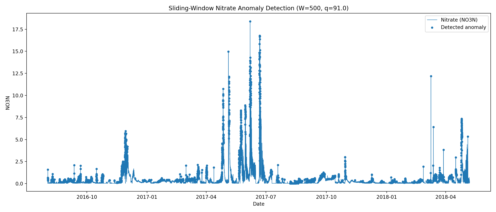

# HW2 — Overlapping Sliding Windows Anomaly Detection

## Method

For this assignment, I used the `NO3N` column from the dataset and applied a fixed-size sliding window with a step size of 1.

I used:

- `W = 500`
- `q = 91`
- Upper-tail detection

A point is marked as an anomaly when its value is greater than or equal to the current percentile threshold.

For the first window, I calculated the threshold using:

```python
T1 = np.percentile(x[0:W], q, method="linear")
```

Then I labeled all of the points in that first window.

After that, the window moves forward one point at a time. For each new window, I recalculate the percentile threshold and only classify the newest point in the window.

The `Student_Flag` column is only used to compare my predictions to the ground truth.

## Choosing W and q

I tested a few different window sizes and percentile values to see which combination worked best.

A window size of 500 gave better anomaly detection than the larger window sizes I tested. I also tested percentile values around 90–92.

| W | q | Normal accuracy | Anomaly accuracy |
|---:|---:|---:|---:|
| 500 | 90 | 84.73% | 75.89% |
| 500 | 91 | 85.76% | 75.18% |
| 500 | 92 | 87.00% | 73.05% |
| 1000 | 90 | 86.86% | 71.63% |
| 1500 | 90 | 85.66% | 71.63% |
| 2000 | 90 | 85.94% | 72.34% |

I chose `W = 500` and `q = 91` because it met both required accuracy targets and gave a good balance between detecting anomalies and avoiding false positives.

## Results

The dataset has 30,790 total data points and 141 actual anomalies.

Using `W = 500` and `q = 91`:

- TP = 106
- FP = 4363
- FN = 35
- TN = 26286

### Normal accuracy

Normal accuracy = TN / (TN + FP)

= 26286 / (26286 + 4363)

= 0.8576

Normal accuracy = 85.76%

### Anomaly accuracy

Anomaly accuracy = TP / (TP + FN)

= 106 / (106 + 35)

= 0.7518

Anomaly accuracy = 75.18%

Both required targets were met:

- Normal accuracy >= 80%
- Anomaly accuracy >= 75%

## Figure

The plot below shows the nitrate values, with the detected anomalies marked.



## Design choices

- I used a one-sided upper threshold.
- The current point is included in the window when calculating the threshold.
- The first window labels all points.
- After the first window, only the newest point is labeled.
- I used `np.percentile(..., method="linear")` as required.
- The provided dataset did not have missing values in the `NO3N` column, so I did not do any extra NaN handling.
